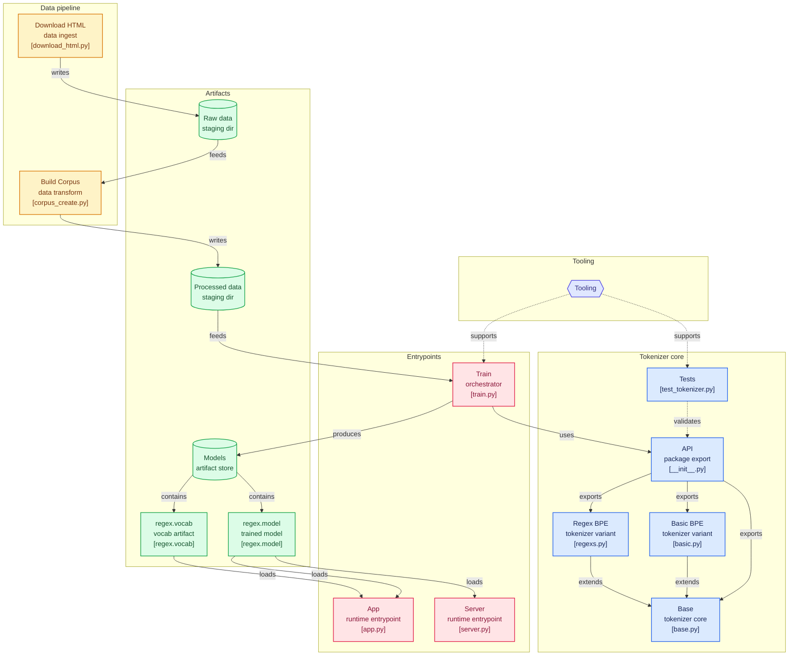

# BPE Tokenizers




## Folder structure
```sh
.
├── app.py
├── data
│   ├── corpus_create.py
│   ├── download_html.py
│   ├── processed
│   └── raw
├── Dockerfile
├── EDA.ipynb
├── LICENSE
├── Makefile
├── minbpe
│   ├── base.py
│   ├── basic.py
│   ├── __init__.py
│   ├── regexs.py
│   └── test_tokenizer.py
├── models
│   ├── regex.model
│   └── regex.vocab
├── pyproject.toml
├── README.md
├── requirements.txt
├── server.py
└── train.py

6 directories, 19 files
```