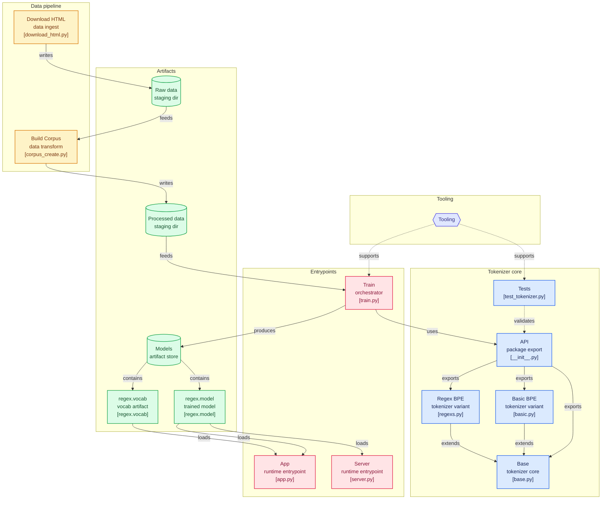

# TamilTokenizer

TamilTokenizer is a byte-level BPE tokenizer project focused on Tamil text.  
It includes:
- A reusable tokenizer package (`minbpe`)
- A corpus preparation pipeline (`data/`)
- A training script to produce tokenizer artifacts (`train.py`)
- A FastAPI inference service (`server.py`)
- A Gradio visualization app (`app.py`)
- A Docker setup for API deployment




## Features

- Byte Pair Encoding (BPE) tokenization with custom merge training
- Tamil-specific regex chunking pattern (`[\u0B80-\u0BFF]+`) for training/encoding
- Save/load tokenizer artifacts (`.model`, `.vocab`)
- REST API endpoint for tokenization
- Interactive Gradio UI for token visualization
- Optional data acquisition and corpus generation from HTML sources

## Folder structure
```sh
.
├── app.py                  # Gradio tokenizer visualizer
├── data
│   ├── corpus_create.py
│   ├── download_html.py
│   ├── processed
│   └── raw
├── Dockerfile         # Containerized API runtime
├── EDA.ipynb
├── LICENSE
├── Makefile
├── minbpe
│   ├── base.py
│   ├── basic.py
│   ├── __init__.py
│   ├── regexs.py
│   └── test_tokenizer.py
├── models
│   ├── regex.model      # Serialized tokenizer merges/config
│   └── regex.vocab      # Human-readable vocabulary dump
├── pyproject.toml
├── README.md
├── requirements.txt      # Project metadata and dependencies (uv)
├── server.py             #  FastAPI API server (/encode)
└── train.py              # Tokenizer training script

6 directories, 19 files
```

## How It Works

### 1) Data Pipeline
1. `data/download_html.py` downloads source HTML files into `data/raw/`.
2. `data/corpus_create.py` parses HTML, extracts text with BeautifulSoup, and keeps Tamil Unicode range characters.
3. Final corpus is written to `data/processed/tamil_corpus.txt`.


### 2) Training
- `train.py` reads `data/processed/tamil_corpus.txt`
- Trains `RegexTokenizer` with `vocab_size=1000`
- Writes artifacts to `models/regex.model` and `models/regex.vocab`

### 3) Inference and Visualization
- `server.py` loads `models/regex.model` and exposes `POST /encode`
- `app.py` loads the same model and renders tokenized text in color via Gradio

## Requirements
- Python 3.10+ recommended
- [uv](https://docs.astral.sh/uv/) (recommended package manager), or `pip`
- Docker (optional, for containerized API)

> Note: `pyproject.toml` currently specifies `>=3.14`, but most tooling and dependencies are compatible with mainstream Python 3.10+ environments.

## Quick Start (Local)
### Option A: Using uv (recommended)
```bash
uv sync
```
Run API server:
```bash
uv run python server.py
```
Run Gradio app:
```bash
uv run python app.py
```


### Option B: Using pip

```bash
python -m venv .venv
source .venv/bin/activate
pip install -r requirements.txt
```

Run API server:
```bash
python server.py
```
Run Gradio app:
```bash
python app.py
```

## API Usage

Start the server (`server.py`) and call:
- Endpoint: `POST /encode`
- Default URL: `http://localhost:8000/encode`

Request:
```json
{ "text": "ஆனந்த சிலை மனம் நெகிழ கண்டார்"}
```

Response (shape):
```json
{
  "token_ids": [ ... ],
  "token_details": [
    {
      "token_id": 123,
      "token_bytes": "b'...'",
      "token_text": "..."
    }
  ],
  "full_text": "..."
}
```

Example with curl:

```bash
curl -X POST "http://localhost:8000/encode" -H "Content-Type: application/json" -d '{"text":"ஆதி அந்தமில்லாத காலம்"}'
```

## Docker
Build image:
```bash
docker build -t tamil-tokenizer:latest .
```

Run container:
```bash
docker run --rm -p 8000:8000 tamil-tokenizer:latest
```
Test the API:
```bash
curl -X POST "http://localhost:8000/encode" \
  -H "Content-Type: application/json" \
  -d '{"text":"தமிழ் மொழி அழகு"}'
```


## Training Your Own Model
If you want to retrain from fresh data:
1. Download raw HTML corpus:
   ```bash
   python data/download_html.py
   ```
2. Build processed corpus:
   ```bash
   python data/corpus_create.py
   ```
3. Train tokenizer and generate model files:
   ```bash
   python train.py
   ```

## Development Commands (Makefile)

```bash
make download-data    # fetch raw corpus sources
make get-corpous      # build processed corpus (spelling kept as in Makefile)
make train-tokenizer  # train tokenizer model
make build-image      # build Docker image (tag: tamil-tiktok:latest)
make gradio           # run Gradio app
make del-model        # remove files in models/
make clean            # remove caches and generated artifacts
```

## Python Usage Example

```python
from minbpe import RegexTokenizer

tokenizer = RegexTokenizer()
tokenizer.load("./models/regex.model")

text = "சிந்தாமணி சிலப்பதிகாரம்"
ids = tokenizer.encode(text)
decoded = tokenizer.decode(ids)

print(ids)
print(decoded)
```

## Testing

Run tests with:

```bash
pytest -q
```

## Notes and Caveats

- `models/regex.model` must exist before running `server.py` or `app.py`.
- The tokenizer currently emphasizes Tamil Unicode block text splitting.
- Data download uses external sources and may fail due to site/network changes.


## License

This project is licensed under the terms in `LICENSE`.